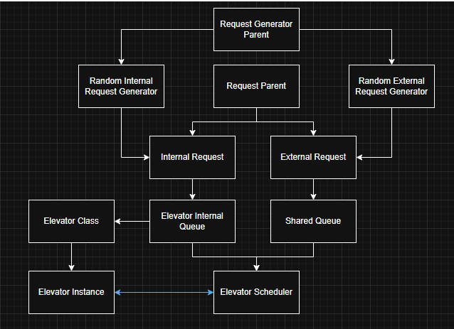

# Elevator Simulation

This project simulates an elevator system using Java.

## Low-Level-Design

## Testing

### Run Tests in Docker
`docker-compose --profile test up`

## How to Run with Docker

Make sure you have [Docker](https://www.docker.com/products/docker-desktop) installed.

### Quick Run
`docker-compose --profile basic up`

### Available Simulations
- **Basic** (50 floors, 2 elevators): `docker-compose --profile basic up`
- **Scaled** (100 floors, 4 elevators): `docker-compose --profile scaled up`  
- **Burj** (163 floors, 8 elevators): `docker-compose --profile burj up`
- **Test** (run unit tests): `docker-compose --profile test up`

### Stop Simulation
`docker-compose down`
